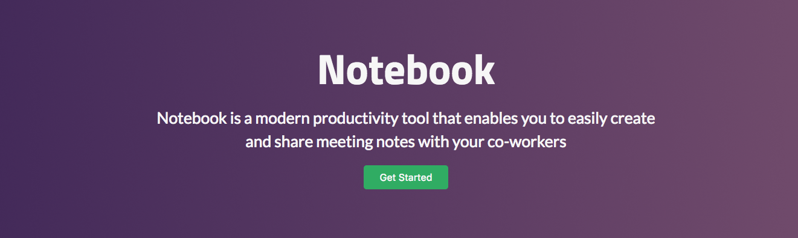

### An open source note sharing engine, with Mongo + Express + GraphQL backend and React + Apollo frontend

## Features

Here are the planned features and their status:

- [x] Login / Signup
  - At present, we only support email auth. We will support OAuth services in the future
- [ ] OAuth
- [x] Notes
- [x] Comments
- [x] Like Comments
- [x] Delete Notes
- [x] Markdown Integration
- [x] Emojis
- [ ] Chat
- [ ] Webcam Chat
- [ ] Personal Messaging
- [ ] stickies
- [ ] Continuous Deployment
- [ ] Heroku Deployment

## Quick Fixes

## License

Notebook is [MIT Licensed](https://github.com/vishalgautamm/notebook/blob/master/License.md).## License
